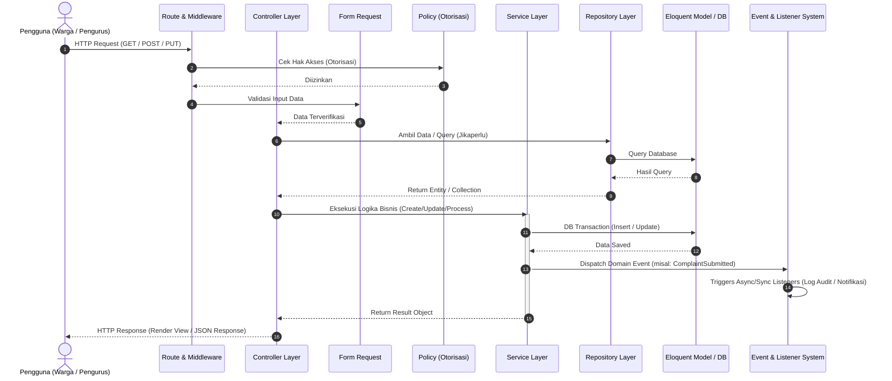
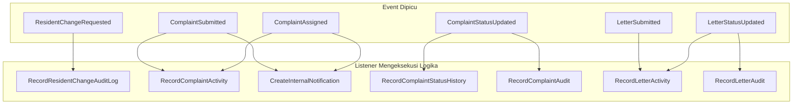

# Developer Documentation (Dokumentasi Pengembang)
## Sistem Informasi Manajemen RW (SIM RW 047)

Dokumen ini berisi panduan teknis dan arsitektur pengembang untuk proyek **Aplikasi SIM RW 047** berbasis framework **Laravel 10**. Dokumentasi ini disusun berdasarkan analisis langsung terhadap kode sumber (*source code*) proyek.

---

## 📋 Daftar Isi

1. [Struktur Folder Laravel](#1-struktur-folder-laravel)
2. [Penjelasan Setiap Modul](#2-penjelasan-setiap-modul)
3. [Arsitektur Kode (Controller, Service, Repository)](#3-arsitektur-kode-controller-service-repository)
4. [Model & Relasi Eloquent (Eloquent Relationships)](#4-model--relasi-eloquent-eloquent-relationships)
5. [Middleware](#5-middleware)
6. [Rute (Route)](#6-rute-route)
7. [Validasi (Validation)](#7-validasi-validation)
8. [Autentikasi & Otorisasi (Authentication & Authorization)](#8-autentikasi--otorisasi-authentication--authorization)
9. [Antrean, Pekerjaan, & Acara (Queue, Job, Event)](#9-antrean-pekerjaan--acara-queue-job-event)
10. [Konfigurasi .env (Environment Configuration)](#10-konfigurasi-env-environment-configuration)
11. [Cara Menjalankan Proyek (How to Run)](#11-cara-menjalankan-proyek-how-to-run)
12. [Cara Menambah Fitur Baru (How to Add New Feature)](#12-cara-menambah-fitur-baru-how-to-add-new-feature)

---

## 1. Struktur Folder Laravel

Berikut adalah struktur direktori utama pada proyek SIM RW 047 beserta penjelasan masing-masing folder:

```text
├── app/
│   ├── Console/            # Perintah kustom CLI Artisan (Commands)
│   ├── DTOs/               # Data Transfer Objects untuk pertukaran data terstruktur
│   ├── Enums/              # Enum terdaftar (Role, Status, Kategori, Tipe Transaksi, dll.)
│   ├── Events/             # Event internal aplikasi (ComplaintSubmitted, LetterSubmitted, dll.)
│   ├── Exceptions/         # Penanganan exception/error global
│   ├── Http/
│   │   ├── Controllers/    # Controller penangan HTTP request (Admin, Auth, Finance, Portal)
│   │   ├── Middleware/     # Penengah HTTP request (Authenticate, RedirectIfAuthenticated, dll.)
│   │   ├── Requests/       # Form Request Validation untuk memvalidasi input pengguna
│   │   └── Kernel.php      # Pendaftaran middleware stack & aliases HTTP
│   ├── Listeners/          # Listener penangan Event (Audit Log, Activity Log, Notifikasi)
│   ├── Models/             # Model Eloquent (User, AnggotaKeluarga, FinancialTransaction, dll.)
│   ├── Policies/           # Kebijakan otorisasi hak akses pengguna per model
│   ├── Providers/          # Service Providers (App, Auth, Event, Route, Broadcast)
│   ├── Repositories/       # Layer Lumbung Data (Query builder & abstraksi akses DB)
│   ├── Services/           # Layer Layanan / Logika Bisnis Utama & Integrasi Eksternal (n8n)
│   └── View/               # Component View & Helpers
├── bootstrap/              # Inisialisasi framework Laravel & autoloader
├── config/                 # Berkas konfigurasi aplikasi (app, database, auth, ai, queue, dll.)
├── database/
│   ├── factories/          # Factory data tiruan untuk testing/seeding
│   ├── migrations/         # Berkas migrasi skema tabel database
│   └── seeders/            # Seeder data awal database (Roles, Users, Master Data)
├── docs/                   # Dokumentasi teknis proyek (Database Reference, dsb.)
├── public/                 # Assets publik (index.php, gambar, CSS/JS terkompilasi)
├── resources/
│   ├── css/                # Stylesheet mentah (TailwindCSS)
│   ├── js/                 # JavaScript frontend (Alpine.js / Axios)
│   └── views/              # Template tampilan Blade (Admin, Warga, Layouts, Components)
├── routes/                 # Pendaftaran Rute Aplikasi (web.php, api.php, auth.php, console.php)
├── storage/                # Penyimpanan berkas internal, log aplikasi, dan file upload
├── tests/                  # Pengujian otomatis (Feature & Unit Testing)
├── .env.example            # Templat konfigurasi lingkungan aplikasi
├── composer.json           # Dependensi paket PHP
├── package.json            # Dependensi paket Node.js & Vite build tool
└── vite.config.js          # Konfigurasi bundler frontend Vite
```

---

## 2. Penjelasan Setiap Modul

Aplikasi SIM RW 047 terbagi menjadi 6 modul utama:

### A. Modul Manajemen Kependudukan (Warga & KK)
- **Fungsi**: Mengelola data primer Kartu Keluarga (`kartu_keluargas`) dan data individu warga (`anggota_keluargas`).
- **Fitur**:
  - Pencatatan nomor KK, lokasi RT/RW, blok, nomor rumah, dan status kepemilikan rumah.
  - Pencatatan NIK warga, data pribadi, status hubungan keluarga, status sosio-ekonomi, dan status kependudukan (`AKTIF`, `PINDAH`, `MENINGGAL`).
  - Pengajuan perubahan data warga (`ResidentChangeRequest`) beserta riwayat perubahan (`ResidentChangeHistory`).

### B. Modul Persuratan (Pengajuan Surat)
- **Fungsi**: Melayani pengajuan surat keterangan bagi warga secara mandiri maupun diproses oleh pengurus RT/RW.
- **Fitur**:
  - **Portal Publik Warga**: Pengajuan surat tanpa login dengan NIK dan pelacakan status surat via kode/NIK.
  - **Panel Pengurus**: Verifikasi dan persetujuan pengajuan surat bertahap (RT -> RW -> Selesai / Ditolak).
  - Recording otomatis histori perubahan status surat (`letter_status_histories`) dan kegiatan (`RecordLetterActivity`).

### C. Modul Laporan & Aspirasi Warga (Pengaduan)
- **Fungsi**: Wadah pengaduan dan aspirasi warga kepada pengurus RT/RW.
- **Fitur**:
  - **Portal Publik Warga**: Form pengiriman keluhan dengan lampiran berkas (`complaint_attachments`) dan pelacakan keluhan.
  - **Panel Pengurus**: Manajerial laporan, perbaruan status (`SUBMITTED`, `IN_PROGRESS`, `RESOLVED`, `REJECTED`), serta pendelegasian tugas ke pengurus/staf (`complaint_assignments`).
  - **Integrasi AI (n8n Layer)**: Pengkategorian otomatis, prioritisasi, dan pembuat ringkasan laporan menggunakan AI via `N8nService`.

### D. Modul Keuangan & Iuran Warga
- **Fungsi**: Transparansi dan akuntabilitas pengelolaan dana iuran serta transaksi keuangan RT/RW.
- **Fitur**:
  - Master jenis iuran (`iuran_types`).
  - Recording pembayaran iuran warga (`catatan_iuran_wargas`) serta verifikasi bukti pembayaran oleh pengurus keuangan.
  - Pembukuan umum (*General Ledger*) melalui `financial_transactions` untuk pencatatan pemasukan dan pengeluaran.
  - Mekanisme koreksi transaksi via reversal/adjustment transaksi keuangan.
  - **Portal Transparansi Keuangan Warga**: Akses laporan riwayat iuran dan keuangan secara publik bagi warga terverifikasi.

### E. Modul Otorisasi & Manajemen Pengguna (Admin Workspace)
- **Fungsi**: Mengelola akun pengguna, hak akses berbasis peran (RBAC), pengaturan sistem, dan log audit.
- **Fitur**:
  - Manajemen akun pengguna (`users`) & status pengguna (`ACTIVE`/`INACTIVE`).
  - Matriks Peran & Izin (`roles`, `permissions`, `role_permissions`).
  - Audit Trail menyeluruh (`audit_logs` & `activity_logs`) untuk setiap tindakan krusial pada sistem.
  - Pengaturan konfigurasi sistem (`system_settings`).

### F. Modul Gateway Portal Publik Warga
- **Fungsi**: Halaman depan terpadu (`/layanan`) yang ramah pengguna untuk warga mengakses seluruh layanan online (Persuratan, Laporan Aspirasi, dan Transparansi Keuangan) tanpa kerumitan alur masuk.

---

## 3. Arsitektur Kode (Controller, Service, Repository)

Aplikasi SIM RW 047 menerapkan **Clean Architecture Pattern** dengan memisahkan kode menjadi 3 layer utama untuk menjaga konsistensi, kemudahan pengujian, serta pemisahan tanggung jawab (*Separation of Concerns*).



### Roles & Responsibilities

| Layer | Lokasi | Tanggung Jawab Utama |
|---|---|---|
| **Controller** | `app/Http/Controllers` | Menerima HTTP Request, menguji otorisasi (`$this->authorize()`), memanggil Form Request, meneruskan eksekusi ke Service / Repository, dan mengembalikan HTTP Response (View / Flash Message / JSON). |
| **Service** | `app/Services` | Mengenkapsulasi seluruh **Logika Bisnis (Domain Logic)**. Bertanggung jawab atas pengelolaan transaksi database (`DB::beginTransaction()`, `commit()`, `rollBack()`), penyimpanan berkas upload, integrasi API eksternal (`N8nService`), serta memicu Event internal aplikasi (`event()`). |
| **Repository** | `app/Repositories` | Mengenkapsulasi **Logika Query Database**. Menyediakan fungsi abstraksi untuk pengambilan data (`getAllPaginated()`, `findById()`, `getBaseQuery()`), pengurutan, pencarian, dan eager loading relasi model. |

---

## 4. Model & Relasi Eloquent (Eloquent Relationships)

Berikut daftar seluruh Model Eloquent dalam aplikasi SIM RW 047 beserta hubungan/relasinya:

### 1. `User` (`app/Models/User.php`)
- **Tabel**: `users` (PK: `user_id`)
- **Relasi**:
  - `belongsTo(Role::class, 'role_id')`: Menghubungkan user dengan peran pengurus/admin.
  - `hasOne(OrganizationalPosition::class, 'user_id')`: Jabatan organisasi aktif user.
  - `hasMany(ComplaintAssignment::class, 'assigned_by_user_id')`: Daftar penugasan laporan yang diberikan oleh user.
  - `hasMany(ComplaintAssignment::class, 'assigned_to_user_id')`: Daftar penugasan laporan yang diterima oleh user.
- **Fungsi Kunci**: `hasPermissionTo($permissionName)` untuk pengecekan otorisasi berbasis peran dan izin.

### 2. `KartuKeluarga` (`app/Models/KartuKeluarga.php`)
- **Tabel**: `kartu_keluargas` (PK: `no_kk`, String 16 digit)
- **Relasi**:
  - `hasMany(AnggotaKeluarga::class, 'no_kk', 'no_kk')`: Seluruh anggota keluarga dalam KK tersebut.

### 3. `AnggotaKeluarga` (`app/Models/AnggotaKeluarga.php`)
- **Tabel**: `anggota_keluargas` (PK: `nik`, String 16 digit)
- **Relasi**:
  - `belongsTo(KartuKeluarga::class, 'no_kk', 'no_kk')`: KK dari warga bersangkutan.
  - `hasMany(ResidentChangeRequest::class, 'nik', 'nik')`: Riwayat permohonan perubahan data kependudukan warga.
  - `hasMany(LogLaporanAspirasi::class, 'nik', 'nik')`: Seluruh laporan aspirasi yang diajukan warga.

### 4. `PengajuanSurat` (`app/Models/PengajuanSurat.php`)
- **Tabel**: `pengajuan_surats` (PK: `pengajuan_id`)
- **Relasi**:
  - `belongsTo(AnggotaKeluarga::class, 'nik', 'nik')`: Pemohon surat (warga).
  - `hasMany(LetterStatusHistory::class, 'pengajuan_id', 'pengajuan_id')`: Riwayat perubahan status surat.

### 5. `LetterStatusHistory` (`app/Models/LetterStatusHistory.php`)
- **Tabel**: `letter_status_histories` (PK: `history_id`)
- **Relasi**:
  - `belongsTo(PengajuanSurat::class, 'pengajuan_id', 'pengajuan_id')`: Surat terkait.
  - `belongsTo(User::class, 'actor_user_id', 'user_id')`: Aktor/pengurus yang memperbarui status.

### 6. `LogLaporanAspirasi` (`app/Models/LogLaporanAspirasi.php`)
- **Tabel**: `log_laporan_aspirasis` (PK: `aspirasi_id`)
- **Relasi**:
  - `belongsTo(AnggotaKeluarga::class, 'nik', 'nik')`: Warga pelapor.
  - `hasMany(ComplaintAssignment::class, 'aspirasi_id', 'aspirasi_id')`: Riwayat penugasan pengerjaan keluhan.
  - `hasMany(ComplaintStatusHistory::class, 'aspirasi_id', 'aspirasi_id')`: Riwayat status keluhan.
  - `hasMany(ComplaintAttachment::class, 'aspirasi_id', 'aspirasi_id')`: Lampiran berkas pendukung keluhan.

### 7. `ComplaintAssignment` (`app/Models/ComplaintAssignment.php`)
- **Tabel**: `complaint_assignments` (PK: `assignment_id`)
- **Relasi**:
  - `belongsTo(LogLaporanAspirasi::class, 'aspirasi_id', 'aspirasi_id')`: Laporan terkait.
  - `belongsTo(User::class, 'assigned_by_user_id', 'user_id')`: Pengurus pemberi tugas.
  - `belongsTo(User::class, 'assigned_to_user_id', 'user_id')`: Staf/pengurus penerima tugas.

### 8. `ComplaintAttachment` (`app/Models/ComplaintAttachment.php`)
- **Tabel**: `complaint_attachments` (PK: `attachment_id`)
- **Relasi**:
  - `belongsTo(LogLaporanAspirasi::class, 'aspirasi_id', 'aspirasi_id')`: Laporan terkait.

### 9. `ComplaintStatusHistory` (`app/Models/ComplaintStatusHistory.php`)
- **Tabel**: `complaint_status_histories` (PK: `history_id`)
- **Relasi**:
  - `belongsTo(LogLaporanAspirasi::class, 'aspirasi_id', 'aspirasi_id')`: Laporan terkait.
  - `belongsTo(User::class, 'actor_user_id', 'user_id')`: Pengurus penanggung jawab perubahan.

### 10. `CatatanIuranWarga` (`app/Models/CatatanIuranWarga.php`)
- **Tabel**: `catatan_iuran_wargas` (PK: `iuran_id`)
- **Relasi**:
  - `belongsTo(KartuKeluarga::class, 'no_kk', 'no_kk')`: KK pembayar iuran.
  - `belongsTo(IuranType::class, 'iuran_type_id', 'id')`: Jenis iuran.
  - `belongsTo(User::class, 'recorded_by_user_id', 'user_id')`: Pengurus pencatat.
  - `belongsTo(User::class, 'approved_by_user_id', 'user_id')`: Pengurus verifikator/penyetuju.
  - `morphOne(FinancialTransaction::class, 'reference')`: Pencatatan transaksi otomatis di *General Ledger*.

### 11. `FinancialTransaction` (`app/Models/FinancialTransaction.php`)
- **Tabel**: `financial_transactions` (PK: `transaction_id`)
- **Relasi**:
  - `morphTo('reference')`: Relasi polimorfik ke sumber transaksi (misal: `CatatanIuranWarga`).
  - `belongsTo(User::class, 'created_by_user_id', 'user_id')`: Pembuat transaksi.
  - `belongsTo(User::class, 'adjusted_by_user_id', 'user_id')`: Pengurus yang melakukan pembatalan/koreksi.
  - `belongsTo(FinancialTransaction::class, 'adjusted_transaction_id', 'transaction_id')`: Transaksi induk yang dikoreksi.
  - `hasOne(FinancialTransaction::class, 'adjusted_transaction_id', 'transaction_id')`: Transaksi pembalik (*reversal transaction*).

### 12. `IuranType` (`app/Models/IuranType.php`)
- **Tabel**: `iuran_types` (PK: `id`)
- **Relasi**:
  - `hasMany(CatatanIuranWarga::class, 'iuran_type_id', 'id')`: Pembayaran iuran pada jenis ini.

### 13. `Role` (`app/Models/Role.php`) & `Permission` (`app/Models/Permission.php`)
- **Tabel**: `roles` (PK: `role_id`), `permissions` (PK: `permission_id`)
- **Relasi**:
  - `Role` -> `belongsToMany(Permission::class, 'role_permissions', 'role_id', 'permission_id')`
  - `Permission` -> `belongsToMany(Role::class, 'role_permissions', 'permission_id', 'role_id')`
  - `Role` -> `hasMany(User::class, 'role_id')`

### 14. Model Pendukung Lainnya
- `OrganizationalPosition`: Jabatan pengurus RT/RW (`belongsTo(User)`).
- `ResidentChangeRequest`: Permohonan ubah data warga (`belongsTo(AnggotaKeluarga)`).
- `ResidentChangeHistory`: Riwayat persetujuan ubah data kependudukan.
- `AuditLog`: Log audit sistem (`belongsTo(User)`).
- `ActivityLog`: Log aktivitas pengguna/sistem (`belongsTo(User)`).
- `SystemSetting`: Pengaturan variabel sistem secara dinamis.

---

## 5. Middleware

Pendaftaran middleware diatur di berkas `app/Http/Kernel.php`:

### A. Global Middleware Stack (`$middleware`)
Dijalankan pada setiap HTTP request:
- `TrustProxies`: Pen penanganan load balancer / proxy IP.
- `HandleCors`: Pengaturan Cross-Origin Resource Sharing.
- `PreventRequestsDuringMaintenance`: Menahan request saat mode *maintenance* aktif.
- `ValidatePostSize`: Memastikan ukuran payload POST tidak melebihi batas server.
- `TrimStrings`: Membersihkan spasi di awal & akhir input string secara otomatis.
- `ConvertEmptyStringsToNull`: Mengubah string kosong `""` menjadi `null`.

### B. Route Middleware Groups (`$middlewareGroups`)
- **`web`**:
  - `EncryptCookies`, `AddQueuedCookiesToResponse`, `StartSession`, `ShareErrorsFromSession`, `VerifyCsrfToken` (Proteksi CSRF), `SubstituteBindings` (Implicit Route Model Binding).
- **`api`**:
  - `ThrottleRequests:api` (Pembatasan jumlah request per menit), `SubstituteBindings`.

### C. Alias Middleware (`$middlewareAliases`)

| Alias | Class Middleware | Fungsi / Peran |
|---|---|---|
| `auth` | `App\Http\Middleware\Authenticate` | Memastikan pengguna telah terautentikasi (login). Jika belum, me-redirect ke halaman login. |
| `guest` | `App\Http\Middleware\RedirectIfAuthenticated` | Memastikan pengguna belum login (misal untuk akses halaman login/register). |
| `can` | `Illuminate\Auth\Middleware\Authorize` | Memeriksa izin/ability pengguna menggunakan Gate/Policy (misal: `can:manage_system`). |
| `verified` | `Illuminate\Auth\Middleware\EnsureEmailIsVerified` | Memastikan email pengguna telah terverifikasi. |
| `signed` | `App\Http\Middleware\ValidateSignature` | Memvalidasi tanda tangan URL sementara (signed URL). |
| `throttle` | `Illuminate\Routing\Middleware\ThrottleRequests` | Mencegah brute-force/rate limiting request. |

---

## 6. Rute (Route)

Rute aplikasi dipisah secara modular di direktori `routes/`:

### A. `routes/web.php`

1. **Rute Publik / Gateway Portal Warga** (Tanpa Autentikasi):
   - `GET /` -> Redirect ke `/layanan`
   - `GET /layanan` -> `PublicPortalController@index` (Portal Utama Services)
   - `GET|POST /layanan/laporan` -> Form & Simpan Laporan Aspirasi Warga (`public.complaints.*`)
   - `GET|POST /layanan/laporan/track` -> Pelacakan Status Keluhan Warga
   - `GET|POST /layanan/surat` -> Form & Simpan Pengajuan Surat (`public.letters.*`)
   - `GET|POST /layanan/surat/track` -> Pelacakan Status Pengajuan Surat
   - `GET|POST /layanan/keuangan/*` -> Portal Transparansi Keuangan & Riwayat Iuran Warga (`portal.finance.*`)

2. **Rute Protected Pengurus / Admin** (Membutuhkan Middleware `auth` & `verified`):
   - `GET /dashboard` -> `DashboardController@index`
   - `GET /profile` -> Profile Management (`profile.edit`, `update`, `destroy`)
   - `RESOURCE /kk` -> View Kartu Keluarga (`KartuKeluargaController`)
   - `RESOURCE /warga` -> View Data Warga (`WargaController`)
   - `PREFIX /complaints` -> Manajemen Laporan Aspirasi (`ComplaintController@index, show, updateStatus, assign`)
   - `PREFIX /letters` -> Manajemen Persuratan (`AdminLetterController@index, show, processRt, forwardRw, complete, reject`)
   - `PREFIX /finances` -> Modul Keuangan (`FinanceDashboardController`, `IuranTypeController`, `FinancialTransactionController`, `ContributionController`, `PaymentVerificationController`)

3. **Rute Super Admin Workspace** (Membutuhkan Middleware `auth`, `verified`, dan `can:manage_system`):
   - `PREFIX /admin` (`admin.*`):
     - `RESOURCE /admin/users` -> User Management & Toggle Status
     - `GET /admin/roles` -> Role & Permission Matrix
     - `GET /admin/permissions` -> Master Permissions List
     - `GET /admin/settings` -> System Settings
     - `GET /admin/audit-log` -> Audit Trail Log

### B. `routes/auth.php`
- Mengatur rute autentikasi standar Breeze: `/login`, `/register`, `/forgot-password`, `/reset-password`, `/logout`, `/verify-email`.

### C. `routes/api.php`
- Rute API terproteksi Sanctum (`auth:sanctum`): `GET /api/user`.

---

## 7. Validasi (Validation)

Aplikasi SIM RW 047 mengadopsi standar **Form Request Validation** Laravel yang terisolasi pada direktori `app/Http/Requests/`.

### Keunggulan Penerapan Form Request:
1. **Pemisahan Validasi & Controller**: Controller tetap bersih (*clean*) dan hanya berfokus pada alur HTTP.
2. **Otorisasi Terintegrasi**: Setiap kelas Form Request memuat method `authorize()` yang memverifikasi hak akses pengguna sebelum aturan validasi dijalankan.

### Daftar Form Request Utama:

| Form Request Class | Diterapkan Pada | Aturan Validasi Utama (*Validation Rules*) |
|---|---|---|
| `StoreWargaRequest` | Tambah Warga Baru | `nik` (size:16, unique), `no_kk` (exists:kartu_keluargas), `jenis_kelamin` (in:L,P), `tanggal_lahir` (date), dsb. |
| `StoreKartuKeluargaRequest` | Tambah KK Baru | `no_kk` (size:16, unique), `rt_code` (max:5), `alamat_lengkap` (required), dsb. |
| `StoreComplaintRequest` | Pengajuan Keluhan Warga | `nik` (exists:anggota_keluargas), `teks_keluhan` (min:10), `attachments` (file, mimes:jpg,png,pdf, max:5MB). |
| `SubmitContributionRequest` | Konfirmasi Bayar Iuran | `no_kk` (exists:kartu_keluargas), `nominal` (numeric|min:1), `periode_bulan` (between:1,12). |
| `StoreTransactionRequest` | Input Transaksi Keuangan | `transaction_type` (in:INCOME,EXPENSE), `category` (enum), `amount` (numeric), `transaction_date` (date). |
| `UpdateComplaintStatusRequest` | Ubah Status Keluhan | `status` (in:ComplaintStatusEnum), `notes` (nullable|string), `priority` (optional). |
| `ApproveContributionRequest` | Verifikasi Setuju Iuran | Validasi kelayakan ID iuran & catatan verifikasi. |
| `RejectContributionRequest` | Penolakan Iuran Warga | `rejection_notes` (required|string). |

---

## 8. Autentikasi & Otorisasi (Authentication & Authorization)

### A. Autentikasi (Authentication)
- **Web Interface**: Berbasis sesi Laravel Session (Breeze Cookie-session) untuk pengurus, RT, RW, dan Super Admin.
- **Portal Publik Warga**: Tanpa akun login tradisional. Warga melakukan verifikasi identitas secara independen dengan memasukkan NIK / Nomor KK yang valid pada database kependudukan.
- **API**: Menggunakan **Laravel Sanctum** (`HasApiTokens`) untuk otorisasi API berbasis bearer token.

### B. Otorisasi (Role-Based Access Control / RBAC)
Sistem memiliki matriks Peran dan Izin yang terdefinisi pada Enums:
- **Peran (`App\Enums\RoleEnum`)**:
  - `SUPER_ADMIN`: Akses penuh ke seluruh fitur dan pengaturan sistem.
  - `RW_ADMIN`: Akses manajemen kependudukan RW, persuratan RW, keluhan, dan transparansi keuangan.
  - `RT_ADMIN`: Akses kependudukan lingkup RT tertentu dan verifikasi awal persuratan/iuran.
  - `WARGA`: Peran dasar warga.
  - `AUDITOR`: Akses pembacaan log audit dan laporan keuangan (*read-only*).

- **Izin (`App\Enums\PermissionEnum`)**:
  - Berisi daftar izin granular seperti `MANAGE_USERS`, `MANAGE_SYSTEM`, `MANAGE_RESIDENTS`, `MANAGE_LETTERS`, `MANAGE_COMPLAINTS`, `MANAGE_FINANCE`, `VERIFY_FINANCE`, `VIEW_AUDIT_LOGS`, dll.

### C. Gate & Policy Integration (`AuthServiceProvider`)
Semua model dilindungi oleh kelas Policy masing-masing di `app/Policies/`:
- `AuthServiceProvider::boot()` mendaftarkan global gate interceptor:
```php
Gate::before(function ($user, $ability) {
    if ($user->hasPermissionTo($ability)) {
        return true;
    }
});
```
- Method `hasPermissionTo()` pada `User.php` secara otomatis me-return `true` apabila `role` pengguna adalah `SUPER_ADMIN`, atau memverifikasi apakah izin tersebut terdaftar dalam tabel `role_permissions`.

---

## 9. Antrean, Pekerjaan, & Acara (Queue, Job, Event)

### A. System Event & Listener Mappings
Sistem menggunakan pola **Event-Driven Architecture** untuk mencatat audit trail dan aktivitas sistem secara asinkron/decoupled. Pemetaan diatur pada `app/Providers/EventServiceProvider.php`:



### B. Integrasi AI Enhancement Layer (n8n Integration)
- Pengaduan warga yang dikirimkan (`ComplaintSubmitted`) memicu event internal.
- Service `N8nService` (`app/Services/N8nService.php`) berkomunikasi via webhook HTTP dengan alur n8n eksternal untuk pemrosesan AI (seperti kategorisasi keluhan, ekstraksi ringkasan, dan estimasi prioritas) tanpa mengganggu logika bisnis utama aplikasi.

### C. Konfigurasi Queue (Antrean Pekerjaan)
- Pengaturan bawaan di `.env`: `QUEUE_CONNECTION=sync` (eksekusi langsung saat request berjalan).
- Untuk perbaikan performa produksi, nilai ini dapat diubah menjadi `redis` atau `database`, lalu pekerja antrean dijalankan melalui perintah:
  ```bash
  php artisan queue:work
  ```

---

## 10. Konfigurasi .env (Environment Configuration)

Daftar variabel lingkungan penting pada berkas `.env`:

```ini
# --- Konfigurasi Dasar Aplikasi ---
APP_NAME="SIM RW 047"
APP_ENV=local               # local | staging | production
APP_KEY=                    # Key enkripsi (dihasilkan via php artisan key:generate)
APP_DEBUG=true              # Set false pada lingkungan produksi
APP_URL=http://localhost:8000

# --- Konfigurasi Database ---
DB_CONNECTION=mysql
DB_HOST=127.0.0.1
DB_PORT=3306
DB_DATABASE=sim_rw_047
DB_USERNAME=root
DB_PASSWORD=

# --- Driver Layanan Inti ---
BROADCAST_DRIVER=log
CACHE_DRIVER=file
FILESYSTEM_DISK=local
QUEUE_CONNECTION=sync
SESSION_DRIVER=file
SESSION_LIFETIME=120

# --- Konfigurasi Email ---
MAIL_MAILER=smtp
MAIL_HOST=mailpit
MAIL_PORT=1025
MAIL_USERNAME=null
MAIL_PASSWORD=null
MAIL_FROM_ADDRESS="admin@rw047.id"
MAIL_FROM_NAME="${APP_NAME}"

# --- Konfigurasi Integrasi AI (n8n Workflow Engine) ---
N8N_ENABLED=true
N8N_BASE_URL=http://localhost:5678
N8N_TIMEOUT=30
```

---

## 11. Cara Menjalankan Proyek (How to Run)

Berikut panduan langkah demi langkah untuk menyiapkan dan menjalankan proyek SIM RW 047 di lingkungan pengembang lokal:

### Prasyarat Perangkat Lunak
- **PHP**: Minimum versi 8.1 (dengan ekstensi `pdo_mysql`, `mbstring`, `openssl`, `curl`)
- **Composer**: Versi 2.x
- **Node.js**: Minimum versi 18.x & **NPM**
- **Database Engine**: MySQL v8.0+ atau MariaDB v10.4+

### Langkah-Langkah Installasi:

1. **Clone & Masuk ke Direktori Proyek**:
   ```bash
   cd "c:/Users/Admin/Documents/SKRIPSI ONGOING/Program Web RW 047/versi 2"
   ```

2. **Install Dependensi PHP (Composer)**:
   ```bash
   composer install
   ```

3. **Install Dependensi Frontend (NPM)**:
   ```bash
   npm install
   ```

4. **Konfigurasi Berkas Environment (`.env`)**:
   Buat salinan berkas `.env.example` menjadi `.env`:
   ```bash
   cp .env.example .env
   ```
   *Sesuaikan nama database, username, dan password MySQL pada berkas `.env`.*

5. **Generate Application Key**:
   ```bash
   php artisan key:generate
   ```

6. **Jalankan Migrasi & Database Seeder**:
   ```bash
   php artisan migrate --seed
   ```
   *Perintah ini akan membuat skema tabel dan mengisi data master awal (Roles, Permissions, dan Super Admin User).*

7. **Buat Symlink Storage Publik**:
   ```bash
   php artisan storage:link
   ```

8. **Menjalankan Server Pengembang (Development Server)**:
   - **Jalankan Laravel Backend**:
     ```bash
     php artisan serve
     ```
     *(Aplikasi backend akan berjalan di `http://127.0.0.1:8000`)*

   - **Jalankan Vite Bundler (Terminal Terpisah)**:
     ```bash
     npm run dev
     ```

9. **Akses Aplikasi**:
   - Open browser dan kunjungi: `http://localhost:8000`

---

## 12. Cara Menambah Fitur Baru (How to Add New Feature)

Untuk menjaga konsistensi arsitektur kode pada SIM RW 047, ikuti panduan standar langkah-demi-langkah berikut saat mengembangkan fitur baru (contoh fitur: **Manajemen Pengumuman / Announcement**):

### Langkah 1: Buat Migration & Model Eloquent
Jalankan perintah Artisan untuk membuat Model beserta berkas Migrasi:
```bash
php artisan make:model Announcement -m
```
Definisikan kolom pada file `database/migrations/YYYY_MM_DD_create_announcements_table.php` dan atribut `$fillable` / relasi pada `app/Models/Announcement.php`.

### Langkah 2: Definisikan Enum / DTO (Jika Diperlukan)
Jika fitur membutuhkan status atau tipe data terbatas, tambahkan Enum baru di `app/Enums/AnnouncementStatusEnum.php`.

### Langkah 3: Buat Layer Repository
Buat berkas baru `app/Repositories/AnnouncementRepository.php` untuk menangani seluruh query database:
```php
namespace App\Repositories;

use App\Models\Announcement;
use Illuminate\Pagination\LengthAwarePaginator;

class AnnouncementRepository
{
    public function getAllPaginated(array $filters = [], int $perPage = 10): LengthAwarePaginator
    {
        $query = Announcement::query();
        if (!empty($filters['search'])) {
            $query->where('title', 'like', '%' . $filters['search'] . '%');
        }
        return $query->latest()->paginate($perPage);
    }
}
```

### Langkah 4: Buat Layer Service
Buat berkas baru `app/Services/AnnouncementService.php` untuk menangani logika bisnis & database transaction:
```php
namespace App\Services;

use App\Models\Announcement;
use Illuminate\Support\Facades\DB;

class AnnouncementService
{
    public function createAnnouncement(array $data): Announcement
    {
        return DB::transaction(function () use ($data) {
            return Announcement::create($data);
        });
    }
}
```

### Langkah 5: Buat Form Request Validation
Jalankan perintah Artisan:
```bash
php artisan make:request StoreAnnouncementRequest
```
Isi aturan validasi di `app/Http/Requests/StoreAnnouncementRequest.php`.

### Langkah 6: Buat Policy Otorisasi
Jalankan perintah Artisan:
```bash
php artisan make:policy AnnouncementPolicy --model=Announcement
```
Daftarkan `AnnouncementPolicy` pada `$policies` di `app/Providers/AuthServiceProvider.php`.

### Langkah 7: Buat Controller
Jalankan perintah Artisan:
```bash
php artisan make:controller AnnouncementController
```
Inject `AnnouncementRepository` dan `AnnouncementService` melalui *Constructor Injection*:
```php
namespace App\Http\Controllers;

use App\Repositories\AnnouncementRepository;
use App\Services\AnnouncementService;
use App\Http\Requests\StoreAnnouncementRequest;

class AnnouncementController extends Controller
{
    public function __construct(
        protected AnnouncementRepository $repository,
        protected AnnouncementService $service
    ) {}

    public function index()
    {
        $this->authorize('viewAny', Announcement::class);
        $announcements = $this->repository->getAllPaginated(request()->all());
        return view('announcements.index', compact('announcements'));
    }

    public function store(StoreAnnouncementRequest $request)
    {
        $this->service->createAnnouncement($request->validated());
        return back()->with('success', 'Pengumuman berhasil diterbitkan.');
    }
}
```

### Langkah 8: Daftarkan Rute & Buat Blade View
1. Tambahkan rute baru pada `routes/web.php` di kelompok middleware yang sesuai (`auth` / `can:...`).
2. Buat berkas tampilan Blade pada `resources/views/announcements/index.blade.php`.

### Langkah 9: Jalankan Pengujian
Buat unit/feature test untuk memastikan fitur berjalan sesuai harapan:
```bash
php artisan make:test AnnouncementTest
php artisan test
```

---

> *Dokumentasi Pengembang SIM RW 047 — Diperbarui pada Juli 2026.*
