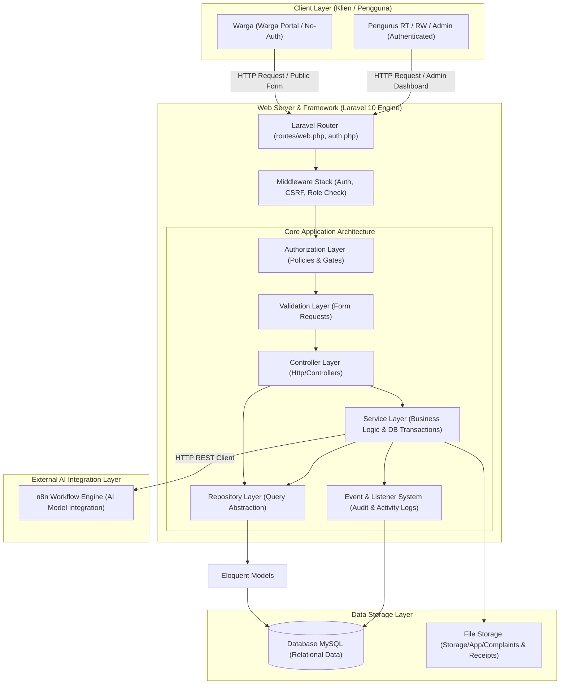
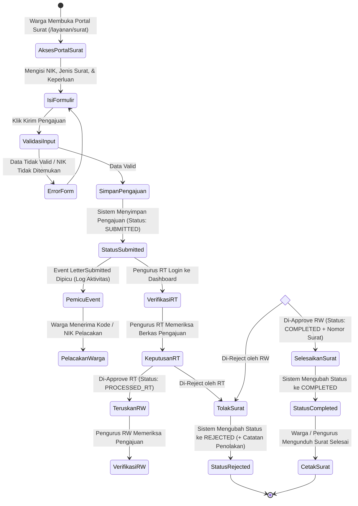
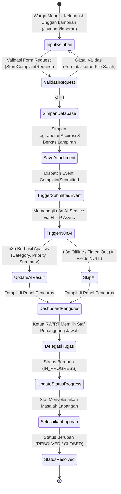
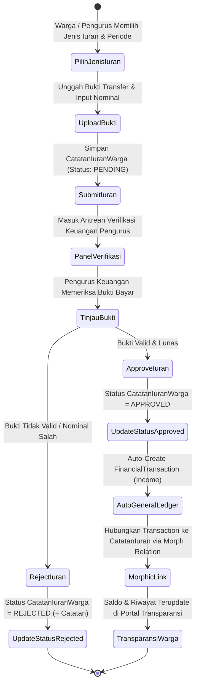
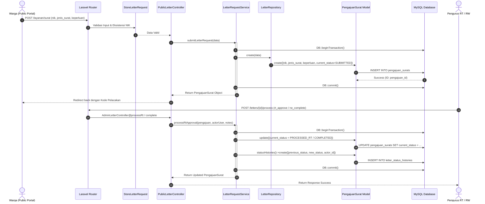
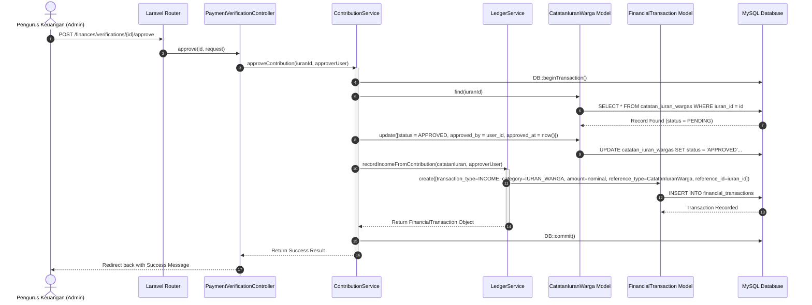

# Arsitektur & Diagram Sistem (System Architecture & Diagrams)
## Aplikasi Sistem Informasi Manajemen RW (SIM RW 047)

Dokumen ini berisi spesifikasi arsitektur teknis dan diagram sistem terstruktur untuk **Aplikasi SIM RW 047** berbasis **Laravel 10**. Dokumen ini dirancang khusus sebagai referensi teknis utama dan bahan penyusunan slide presentasi sidang skripsi.

---

## 📋 Daftar Isi

1. [Gambaran Umum Arsitektur Sistem (System Architecture Overview)](#1-gambaran-umum-arsitektur-sistem-system-architecture-overview)
2. [Diagram Kasus Penggunaan (Use Case Diagram)](#2-diagram-kasus-penggunaan-use-case-diagram)
3. [Diagram Aktivitas (Activity Diagram)](#3-diagram-aktivitas-activity-diagram)
4. [Diagram Urutan (Sequence Diagram)](#4-diagram-urutan-sequence-diagram)
5. [Diagram Kelas (Class Diagram)](#5-diagram-kelas-class-diagram)
6. [Entity Relationship Diagram (ERD)](#6-entity-relationship-diagram-erd)
7. [Alur Bisnis & Aturan Sistem (Business Logic & System Rules)](#7-alur-bisnis--aturan-sistem-business-logic--system-rules)

---

## 1. Gambaran Umum Arsitektur Sistem (System Architecture Overview)

### A. Pola Arsitektur (*Architectural Pattern*)
Aplikasi SIM RW 047 menerapkan pola arsitektur **Controller-Service-Repository** yang memperluas arsitektur standar MVC (Model-View-Controller) milik Laravel. Pola ini memisahkan tanggung jawab sistem secara tegas (*Separation of Concerns*) menjadi beberapa lapisan (*layers*):

1. **Presentation Layer (View & Controller)**:
   - **Blade Engine / TailwindCSS / Alpine.js**: Menampilkan antarmuka pengguna (UI) yang responsif dan interaktif.
   - **Controllers**: Menerima request HTTP, memvalidasi input via Form Request, menguji otorisasi Policy, dan mengembalikan HTTP Response.
2. **Domain & Business Logic Layer (Services & Enums)**:
   - **Services**: Mengenkapsulasi logika bisnis utama, mengelola transaksi database (`DB::transaction`), mengelola berkas upload, serta menangani pemicuan Event internal aplikasi dan integrasi layanan eksternal.
   - **Enums**: Menjamin konsistensi tipe data status, kategori, dan peran.
3. **Data Access Layer (Repositories & Models)**:
   - **Repositories**: Mengabstraksi query database Eloquent, menangani paginasi, filter pencarian, dan eager loading relasi.
   - **Eloquent Models**: Pemetaan objek ke tabel database MySQL beserta relasi antar entitas.
4. **Integration Layer (External Services & AI)**:
   - **N8nService**: Layanan terintegrasi via HTTP REST API menuju *workflow engine* n8n untuk pemrosesan AI (kategorisasi otomatis, analisis prioritas, dan pembuatan ringkasan keluhan warga).

### B. Diagram Arsitektur Tingkat Tinggi (*High-Level Architecture Diagram*)



---

## 2. Diagram Kasus Penggunaan (Use Case Diagram)

### A. Identifikasi Aktor Sistem

1. **Warga**: Anggota masyarakat RW 047 yang dapat mengakses layanan publik (persuratan, laporan keluhan, dan transparansi keuangan) tanpa perlu akun login melalui verifikasi identitas NIK / No. KK.
2. **Ketua RT (Pengurus RT)**: Pengurus tingkat RT yang bertugas mengelola data kependudukan RT, melakukan verifikasi tahap pertama pengajuan surat, serta mencatat iuran warga.
3. **Ketua RW (Pengurus RW)**: Pengurus tingkat RW yang bertugas memberikan persetujuan akhir pengajuan surat, mendistribusikan laporan keluhan warga, dan memantau transparansi keuangan RW.
4. **Admin System (Super Admin)**: Pengelola sistem yang memiliki hak akses penuh untuk manajemen akun user, matriks peran (*roles & permissions*), konfigurasi sistem, dan log audit.
5. **Auditor**: Aktor dengan hak akses pembacaan (*read-only*) laporan keuangan dan log audit untuk kebutuhan pemeriksaan keuangan/sistem.

### B. Diagram Use Case Visual (Mermaid)

```mermaid
graph TD
    actorWarga((Warga))
    actorRT((Ketua RT))
    actorRW((Ketua RW))
    actorAdmin((Super Admin))

    subgraph SIM_RW_047 ["Sistem Informasi Manajemen RW 047"]
        %% Portal Publik Warga
        UC1[UC-01: Mengajukan Surat Keterangan]
        UC2[UC-02: Melacak Status Pengajuan Surat]
        UC3[UC-03: Mengirim Laporan Aspirasi / Keluhan]
        UC4[UC-04: Melacak Status Keluhan]
        UC5[UC-05: Melihat Transparansi Keuangan & Iuran]
        UC6[UC-06: Mengirim Konfirmasi Pembayaran Iuran]

        %% Modul Kependudukan & Pengurus
        UC7[UC-07: Mengelola Data Kartu Keluarga]
        UC8[UC-08: Mengelola Data Warga / Anggota Keluarga]
        UC9[UC-09: Verifikasi Pengajuan Surat Tahap RT]
        UC10[UC-10: Persetujuan Akhir Surat Tahap RW]
        UC11[UC-11: Memproses & Mdelegasikan Keluhan Warga]
        UC12[UC-12: Mencatat & Memverifikasi Pembayaran Iuran]
        UC13[UC-13: Mengelola Kas & Pembukuan Transaksi Keuangan]

        %% Modul Admin & Keamanan
        UC14[UC-14: Otentikasi Login & Profil Pengurus]
        UC15[UC-15: Mengelola Akun User & Status Akun]
        UC16[UC-16: Mengatur Hak Akses Role & Permission Matrix]
        UC17[UC-17: Memantau Log Audit & Activity Log]
    end

    %% Relasi Warga
    actorWarga --> UC1
    actorWarga --> UC2
    actorWarga --> UC3
    actorWarga --> UC4
    actorWarga --> UC5
    actorWarga --> UC6

    %% Relasi Ketua RT
    actorRT --> UC14
    actorRT --> UC7
    actorRT --> UC8
    actorRT --> UC9
    actorRT --> UC11
    actorRT --> UC12

    %% Relasi Ketua RW
    actorRW --> UC14
    actorRW --> UC7
    actorRW --> UC8
    actorRW --> UC10
    actorRW --> UC11
    actorRW --> UC12
    actorRW --> UC13

    %% Relasi Admin System
    actorAdmin --> UC14
    actorAdmin --> UC15
    actorAdmin --> UC16
    actorAdmin --> UC17
    actorAdmin --> UC13
```



---

## 3. Diagram Aktivitas (Activity Diagram)

### A. Activity Diagram: Alur Pengajuan & Persetujuan Surat Keterangan



### B. Activity Diagram: Alur Pengaduan Warga & Kategorisasi AI



### C. Activity Diagram: Alur Pembayaran Iuran & General Ledger Posting



---

## 4. Diagram Urutan (Sequence Diagram)

### A. Sequence Diagram 1: Pengajuan Surat Keterangan oleh Warga & Approval Pengurus



### B. Sequence Diagram 2: Verifikasi Pembayaran Iuran & Auto-Posting General Ledger Keuangan



---

## 5. Diagram Kelas (Class Diagram)

```mermaid
classDiagram
    %% Controller Layer
    class PublicLetterController {
        +create()
        +store(StoreLetterRequest request)
        +track(Request request)
    }

    class AdminLetterController {
        -LetterRepository repository
        -LetterApprovalService approvalService
        +index(Request request)
        +show(PengajuanSurat letter)
        +processRt(Request request, PengajuanSurat letter)
        +complete(CompleteLetterRequest request, PengajuanSurat letter)
    }

    class PaymentVerificationController {
        -ContributionService contributionService
        +index(Request request)
        +approve(int id, ApproveContributionRequest request)
        +reject(int id, RejectContributionRequest request)
    }

    %% Service Layer
    class LetterRequestService {
        +submitLetterRequest(array data) PengajuanSurat
    }

    class LetterApprovalService {
        +processRtApproval(PengajuanSurat letter, User actor, string notes)
        +completeLetter(PengajuanSurat letter, string nomorSurat, User actor, string notes)
        +rejectLetter(PengajuanSurat letter, User actor, string notes)
    }

    class ContributionService {
        -LedgerService ledgerService
        +submitContribution(array data) CatatanIuranWarga
        +approveContribution(int iuranId, User approver) CatatanIuranWarga
        +rejectContribution(int iuranId, User approver, string notes) CatatanIuranWarga
    }

    class LedgerService {
        +recordIncomeFromContribution(CatatanIuranWarga contribution, User creator) FinancialTransaction
        +createTransaction(array data, User creator) FinancialTransaction
        +reverseTransaction(FinancialTransaction tx, User adjuster, string reason) FinancialTransaction
    }

    %% Repository Layer
    class LetterRepository {
        +getBaseQuery() Builder
        +getAllPaginated(array filters, int perPage) LengthAwarePaginator
        +findById(int id) PengajuanSurat
    }

    class WargaRepository {
        +findByNik(string nik) AnggotaKeluarga
        +getPaginatedByRt(string rtCode, int perPage) LengthAwarePaginator
    }

    %% Eloquent Models
    class User {
        +int user_id
        +int role_id
        +string username
        +string email
        +string status
        +role() BelongsTo
        +hasPermissionTo(string permission) bool
    }

    class AnggotaKeluarga {
        +string nik
        +string no_kk
        +string nama_lengkap
        +string status_warga
        +kartuKeluarga() BelongsTo
        +complaints() HasMany
    }

    class PengajuanSurat {
        +int pengajuan_id
        +string nik
        +string nomor_surat
        +LetterTypeEnum jenis_surat
        +LetterStatusEnum current_status
        +pemohon() BelongsTo
        +statusHistories() HasMany
    }

    class CatatanIuranWarga {
        +int iuran_id
        +string no_kk
        +int iuran_type_id
        +float nominal
        +PaymentStatus status
        +kartuKeluarga() BelongsTo
        +ledgerEntry() MorphOne
    }

    class FinancialTransaction {
        +int transaction_id
        +string transaction_number
        +TransactionType transaction_type
        +float amount
        +string reference_type
        +int reference_id
        +reference() MorphTo
    }

    %% Relationships
    AdminLetterController --> LetterRepository
    AdminLetterController --> LetterApprovalService
    PublicLetterController --> LetterRequestService
    PaymentVerificationController --> ContributionService
    ContributionService --> LedgerService
    LetterApprovalService --> PengajuanSurat
    ContributionService --> CatatanIuranWarga
    LedgerService --> FinancialTransaction
    PengajuanSurat --> AnggotaKeluarga
    CatatanIuranWarga --> FinancialTransaction
    User --> Role
```



---

## 6. Entity Relationship Diagram (ERD)

Berikut adalah **ERD Lengkap** dalam format Mermaid yang memetakan seluruh entitas tabel basis data SIM RW 047 beserta hubungan cardinalities dan foreign key:

```mermaid
erDiagram
    roles ||--o{ users : "has"
    roles }|--|{ permissions : "role_permissions"
    users ||--o{ audit_logs : "creates"
    users ||--o{ activity_logs : "triggers"
    users ||--oO organizational_positions : "holds"

    kartu_keluargas ||--|{ anggota_keluargas : "contains"
    kartu_keluargas ||--o{ catatan_iuran_wargas : "pays"

    anggota_keluargas ||--o{ pengajuan_surats : "applies"
    anggota_keluargas ||--o{ log_laporan_aspirasis : "reports"
    anggota_keluargas ||--o{ resident_change_requests : "requests_change"

    pengajuan_surats ||--o{ letter_status_histories : "has_history"
    users ||--o{ letter_status_histories : "updates"

    log_laporan_aspirasis ||--o{ complaint_assignments : "assigned_via"
    log_laporan_aspirasis ||--o{ complaint_attachments : "has_attachments"
    log_laporan_aspirasis ||--o{ complaint_status_histories : "has_history"
    users ||--o{ complaint_assignments : "assigned_to/by"
    users ||--o{ complaint_status_histories : "updates"

    iuran_types ||--o{ catatan_iuran_wargas : "categorizes"
    users ||--o{ catatan_iuran_wargas : "records/approves"

    catatan_iuran_wargas ||--o| financial_transactions : "morph_reference"
    users ||--o{ financial_transactions : "creates/adjusts"
    financial_transactions ||--o| financial_transactions : "reversal_adjustment"

    roles {
        bigint role_id PK
        string role_name UK
        string description
        boolean is_active
    }

    permissions {
        bigint permission_id PK
        string permission_name UK
        string description
        boolean is_active
    }

    users {
        bigint user_id PK
        bigint role_id FK
        string username UK
        string email UK
        string password
        string full_name
        string phone_number
        enum status
        timestamp last_login_at
    }

    kartu_keluargas {
        string no_kk PK
        string rt_code
        text alamat_lengkap
        string blok
        string nomor_rumah
        string status_kepemilikan_rumah
    }

    anggota_keluargas {
        string nik PK
        string no_kk FK
        string nama_lengkap
        enum jenis_kelamin
        string tempat_lahir
        date tanggal_lahir
        string pekerjaan
        string nomor_hp
        string status_hubungan_keluarga
        string status_sosio_ekonomi
        string status_warga
    }

    pengajuan_surats {
        bigint pengajuan_id PK
        string nik FK
        string nomor_surat
        string jenis_surat
        text keperluan
        string current_status
        timestamp tanggal_pengajuan
        timestamp tanggal_selesai
    }

    letter_status_histories {
        bigint history_id PK
        bigint pengajuan_id FK
        bigint actor_user_id FK
        string previous_status
        string new_status
        text notes
        timestamp changed_at
    }

    log_laporan_aspirasis {
        bigint aspirasi_id PK
        string nik FK
        string kanal_laporan
        text teks_keluhan
        string ai_category
        string ai_priority
        text ai_summary
        decimal ai_confidence
        string current_status
        timestamp submitted_at
        timestamp resolved_at
    }

    complaint_assignments {
        bigint assignment_id PK
        bigint aspirasi_id FK
        bigint assigned_by_user_id FK
        bigint assigned_to_user_id FK
        timestamp assigned_at
        text notes
    }

    complaint_attachments {
        bigint attachment_id PK
        bigint aspirasi_id FK
        string file_name
        string file_path
        string file_type
        timestamp uploaded_at
    }

    complaint_status_histories {
        bigint history_id PK
        bigint aspirasi_id FK
        bigint actor_user_id FK
        string previous_status
        string new_status
        text notes
        timestamp changed_at
    }

    iuran_types {
        bigint id PK
        string name
        text description
        decimal default_nominal
        string type
        boolean is_active
    }

    catatan_iuran_wargas {
        bigint iuran_id PK
        string no_kk FK
        bigint iuran_type_id FK
        decimal nominal
        int periode_bulan
        int periode_tahun
        date tanggal_pembayaran
        bigint recorded_by_user_id FK
        bigint approved_by_user_id FK
        timestamp approved_at
        string status
        string payment_proof_path
        text rejection_notes
    }

    financial_transactions {
        bigint transaction_id PK
        string transaction_number UK
        string rt_code
        string transaction_type
        string category
        decimal amount
        text description
        date transaction_date
        string reference_type
        bigint reference_id
        bigint adjusted_transaction_id FK
        bigint adjusted_by_user_id FK
        timestamp adjusted_at
        bigint created_by_user_id FK
    }

    audit_logs {
        bigint audit_id PK
        bigint user_id FK
        string entity_type
        string entity_id
        string action
        json old_value
        json new_value
        string ip_address
        string user_agent
        string source
    }
```

---

## 7. Alur Bisnis & Aturan Sistem (Business Logic & System Rules)

### A. Aturan Otorisasi Berbasis Peran (Role-Based Access Control / RBAC)
1. **Hak Akses Super Admin**:
   - Memiliki akses mutlak (*full bypass*) ke seluruh fitur sistem melalui pengecekan `hasPermissionTo()`.
   - Hanya Super Admin yang berhak mengelola akun pengguna, mengubah matriks izin, dan membuka log audit keamanan.
2. **Hak Akses Ketua RT**:
   - Terbatas pada pengolahan data warga dan KK yang memiliki `rt_code` sesuai dengan wilayah tugasnya.
   - Melakukan persetujuan awal persuratan (`PROCESSED_RT`).
3. **Hak Akses Ketua RW**:
   - Memiliki jangkauan data seluruh RT di lingkup RW 047.
   - Memberikan persetujuan akhir persuratan (`COMPLETED` + Generasi Nomor Surat resmi) dan mengelola pembukuan umum kas RW.
4. **Warga Tanpa Akun**:
   - Dapat mengakses Portal Publik Layanan RW tanpa registrasi akun, dengan syarat menyertakan data NIK dan No. KK yang terverifikasi dalam database kependudukan.

### B. Aturan Integrasi Pembukuan Keuangan (General Ledger Posting Rules)
1. **Prinsip Imutabilitas Ledger**:
   - Setiap data transaksi di `financial_transactions` yang sudah dicatat tidak boleh di-update atau dihapus secara langsung (*no hard delete/direct update*).
2. **Aturan Koreksi / Reversal Transaksi**:
   - Jika terdapat kesalahan pencatatan transaksi keuangan, pengurus harus melakukan aksi **Reversal/Adjustment**.
   - Sistem akan membuat baris transaksi baru (*reversal transaction*) dengan memasukkan ID transaksi lama pada kolom `adjusted_transaction_id` dan mencatat user pengoreksi pada `adjusted_by_user_id`.

### C. Aturan Integrasi AI (n8n Workflow Engine Rules)
1. **Non-Blocking / Fault-Tolerant AI Execution**:
   - AI hanya berfungsi sebagai *Enhancement Layer* (fitur pembantu) dan **tidak boleh menggagalkan** logika bisnis utama pengaduan warga.
   - Apabila server n8n offline atau mengalami *timeout*, keluhan warga tetap tersimpan di database dengan kolom analisis AI bernilai `NULL`.

### D. Aturan Soft Delete & Audit Trail
1. **Penanganan Data Terhapus (*Soft Deletes*)**:
   - Entitas krusial (`users`, `kartu_keluargas`, `anggota_keluargas`, `pengajuan_surats`, `log_laporan_aspirasis`) menggunakan trait `SoftDeletes` Laravel (`deleted_at`).
2. **Audit Logging Otomatis**:
   - Perubahan status pada surat dan keluhan warga secara otomatis memicu Event yang didengar oleh Listener untuk mencatat entri ke `activity_logs`, `audit_logs`, `letter_status_histories`, dan `complaint_status_histories`.

---

> *Arsitektur & Diagram Sistem SIM RW 047 — Disiapkan untuk Sidang Skripsi (Juli 2026).*
